# UML Class Diagram — Jewish On The Way

```mermaid
classDiagram
    %% ══════════════════════════════════════════════
    %% ENTITIES
    %% ══════════════════════════════════════════════

    class User {
        +int id
        +string email
        +string firstName
        +string lastName
        +string role
        +string kashrutLevel
        +boolean isActive
        +Date createdAt
    }

    class Destination {
        +int id
        +string name
        +string city
        +string country
        +string countryCode
        +int parentId
        +geography location
        +Date createdAt
    }

    class Restaurant {
        +int id
        +string name
        +string kashrutLevel
        +string restaurantType
        +string googlePlaceId
        +string address
        +boolean isKosher
        +geography location
        +Date createdAt
    }

    class Synagogue {
        +int id
        +string name
        +string denomination
        +string address
        +string phone
        +string source
        +boolean manuallyVerified
        +geography location
        +Date createdAt
    }

    class CandidateSynagogue {
        +int id
        +string name
        +string denomination
        +string source
        +string sourceId
        +string status
        +geography location
        +Date createdAt
    }

    class Minyan {
        +int id
        +string prayerType
        +string date
        +string time
        +string locationText
        +int participantsCount
        +Date createdAt
    }

    class MinyanRegistration {
        +int id
        +int userId
        +int minyanId
        +Date registeredAt
    }

    class HostingOffer {
        +int id
        +Date available_from
        +Date available_to
        +int max_guests
        +string kashrut_level
        +boolean is_active
        +Date created_at
    }

    class HostingRequest {
        +int id
        +Date arrival_date
        +Date departure_date
        +int guests_count
        +string status
        +boolean for_shabbat
        +Date created_at
    }

    class HostingChatMessage {
        +int id
        +string content
        +Date createdAt
    }

    class ChatMessage {
        +int id
        +string content
        +Date createdAt
    }

    class UserFavorite {
        +int id
        +string entityType
        +int entityId
        +Date createdAt
    }

    class PlaceReview {
        +int id
        +string entityType
        +int entityId
        +int stars
        +string comment
        +Date createdAt
    }

    class PlaceReport {
        +int id
        +string entityType
        +int entityId
        +string reportType
        +string status
        +Date createdAt
    }

    class PlaceRequest {
        +int id
        +string entityType
        +string name
        +string status
        +Date createdAt
    }

    class SearchFeedback {
        +int id
        +string query
        +string detectedType
        +string detectedKashrut
        +string detectedKeyword
        +string clickedRestaurantName
        +Date createdAt
    }

    %% ══════════════════════════════════════════════
    %% ENTITY RELATIONSHIPS
    %% ══════════════════════════════════════════════

    Destination "1" --> "0..*" Destination       : parent / children
    Destination "1" --> "0..*" Restaurant         : has
    Destination "1" --> "0..*" Synagogue          : has
    Destination "1" --> "0..*" CandidateSynagogue : has
    Destination "1" --> "0..*" Minyan             : has
    Destination "1" --> "0..*" ChatMessage        : has
    Destination "1" --> "0..*" HostingOffer       : has
    Destination "1" --> "0..*" HostingRequest     : has
    Destination "1" --> "0..*" PlaceRequest       : has

    User "1" --> "0..*" Minyan              : creates
    User "1" --> "0..*" MinyanRegistration  : registers
    User "1" --> "0..*" UserFavorite        : saves
    User "1" --> "0..*" PlaceReview         : writes
    User "1" --> "0..*" PlaceReport         : submits
    User "1" --> "0..*" PlaceRequest        : requests
    User "1" --> "0..*" ChatMessage         : sends
    User "1" --> "0..*" HostingOffer        : offers
    User "1" --> "0..*" HostingRequest      : requests
    User "1" --> "0..*" HostingChatMessage  : chats

    Minyan       "1" --> "0..*" MinyanRegistration  : has
    HostingOffer "1" --> "0..*" HostingRequest      : receives
    HostingRequest "1" --> "0..*" HostingChatMessage : has

    %% ══════════════════════════════════════════════
    %% SERVICES
    %% ══════════════════════════════════════════════

    class AuthService {
        +register()
        +login()
        +forgotPassword()
        +resetPassword()
    }

    class UsersService {
        +getCurrentUser()
        +updateCurrentUser()
        +changePassword()
        +deleteCurrentUser()
    }

    class RestaurantsService {
        +findByDestination()
        +findNearby()
        +importFromData()
        +reclassifyExisting()
    }

    class SynagoguesService {
        +findByDestination()
        +findNearby()
        +findOne()
    }

    class MinyansService {
        +findUpcoming()
        +create()
        +register()
        +unregister()
        +deleteMinyan()
    }

    class HostingService {
        +createOffer()
        +deactivateOffer()
        +createRequest()
        +updateRequestStatus()
        +searchOffers()
    }

    class ReviewsService {
        +getReviews()
        +upsertReview()
        +deleteReview()
        +createReport()
        +createRequest()
    }

    class FavoritesService {
        +toggle()
        +getAll()
        +isSaved()
    }

    class DestinationsService {
        +findAll()
        +findOne()
    }

    class AdminService {
        +createDestination()
        +deleteDestination()
        +createRestaurant()
        +deleteRestaurant()
        +blockUser()
        +approveCandidateSynagogue()
        +rejectCandidateSynagogue()
    }

    class ManualSynagogueImportService {
        +bulkImport()
        +regeocodeDestination()
        -geocodeAddress()
    }

    class ClassifierService {
        +classify() ClassifyResult
        -loadModel()
        -transform()
    }

    class DenominationClassifierService {
        +classify() DenominationResult
        -loadModel()
        -transform()
    }

    class SearchClassifierService {
        +classify() ClassifiedQuery
        -buildFewShotExamples()
    }

    class GeocodingService {
        +geocode()
    }

    class MailService {
        +sendPasswordReset()
    }

    class AuditService {
        +log()
    }

    class CloudinaryService {
        +uploadImage()
        +deleteImage()
    }

    class PlacesService {
        +syncDestination()
        +importFromOsm()
        +importKosherRestaurants()
    }

    %% ══════════════════════════════════════════════
    %% SERVICE → ENTITY DEPENDENCIES (repos)
    %% ══════════════════════════════════════════════

    AuthService               ..> User              : repo
    AuthService               ..> MailService        : uses
    AuthService               ..> AuditService       : uses

    UsersService              ..> User              : repo

    RestaurantsService        ..> Restaurant        : repo
    RestaurantsService        ..> Destination       : repo
    RestaurantsService        ..> GeocodingService  : uses

    SynagoguesService         ..> Synagogue         : repo

    MinyansService            ..> Minyan            : repo
    MinyansService            ..> MinyanRegistration : repo
    MinyansService            ..> Destination       : repo
    MinyansService            ..> User              : repo
    MinyansService            ..> AuditService      : uses

    HostingService            ..> HostingOffer      : repo
    HostingService            ..> HostingRequest    : repo
    HostingService            ..> Destination       : repo
    HostingService            ..> User              : repo
    HostingService            ..> AuditService      : uses

    ReviewsService            ..> PlaceReview       : repo
    ReviewsService            ..> PlaceReport       : repo
    ReviewsService            ..> PlaceRequest      : repo

    FavoritesService          ..> UserFavorite      : repo
    FavoritesService          ..> Restaurant        : repo
    FavoritesService          ..> Synagogue         : repo

    DestinationsService       ..> Destination       : repo

    AdminService              ..> Destination       : repo
    AdminService              ..> Restaurant        : repo
    AdminService              ..> Synagogue         : repo
    AdminService              ..> CandidateSynagogue : repo
    AdminService              ..> User              : repo
    AdminService              ..> ChatMessage       : repo
    AdminService              ..> PlacesService     : uses

    ManualSynagogueImportService ..> Destination    : repo
    ManualSynagogueImportService ..> Synagogue      : repo

    SearchClassifierService   ..> SearchFeedback    : repo

    PlacesService             ..> Restaurant        : repo
    PlacesService             ..> Synagogue         : repo
    PlacesService             ..> CandidateSynagogue : repo
```

## Summary

| Layer | Count | Notes |
|-------|-------|-------|
| **Entities** | 16 | TypeORM entities mapped to PostgreSQL tables |
| **Services** | 19 | NestJS `@Injectable()` providers |
| **Entity relationships** | 17 | OneToMany / ManyToOne (2 polymorphic via `entityType`) |
| **Service dependencies** | 30 | `@InjectRepository` + service-to-service |

> **Polymorphic FKs:** `UserFavorite`, `PlaceReview`, `PlaceReport` use `entityType + entityId` to reference either `Restaurant` or `Synagogue` — shown without FK arrows since the target table is runtime-determined.
