# Entity Relationship Diagram — Jewish On The Way

```mermaid
erDiagram

    users {
        int id PK
        string email UK
        string passwordHash
        string firstName
        string lastName
        string role
        string kashrutLevel
        timestamp createdAt
        timestamp deletedAt
    }

    destinations {
        int id PK
        string name
        string city
        string country
        string countryCode
        int parentId FK
        geography location
        timestamp createdAt
    }

    synagogues {
        int id PK
        int destinationId FK
        string name
        string normalizedName
        string denomination
        string address
        string phone
        string source
        geography location
        boolean manuallyVerified
        timestamp createdAt
    }

    candidate_synagogues {
        int id PK
        int destinationId FK
        string name
        string normalizedName
        string denomination
        string source
        string sourceId
        string status
        geography location
        timestamp createdAt
    }

    restaurants {
        int id PK
        int destinationId FK
        string name
        string kashrutLevel
        string restaurantType
        string googlePlaceId UK
        string address
        string phone
        string category
        geography location
        boolean isKosher
        timestamp createdAt
    }

    minyans {
        int id PK
        int destinationId FK
        int creatorId FK
        string prayerType
        date date
        string time
        string locationText
        int participantsCount
        timestamp createdAt
    }

    minyan_registrations {
        int id PK
        int userId FK
        int minyanId FK
        timestamp registeredAt
    }

    user_favorites {
        int id PK
        int userId FK
        string entityType
        int entityId
        timestamp createdAt
    }

    place_reviews {
        int id PK
        int userId FK
        string entityType
        int entityId
        int stars
        text comment
        timestamp createdAt
    }

    place_reports {
        int id PK
        int userId FK
        string entityType
        int entityId
        string reportType
        string status
        text adminNote
        timestamp createdAt
    }

    place_requests {
        int id PK
        int userId FK
        int destinationId FK
        string entityType
        string name
        string kashrutLevel
        string denomination
        string status
        text adminNote
        timestamp createdAt
    }

    chat_messages {
        int id PK
        int userId FK
        int destinationId FK
        text content
        timestamp createdAt
    }

    hosting_offers {
        int id PK
        int userId FK
        int destinationId FK
        date available_from
        date available_to
        int max_guests
        string kashrut_level
        boolean allows_shabbat
        boolean is_active
        timestamp created_at
    }

    hosting_requests {
        int id PK
        int userId FK
        int destinationId FK
        int offerId FK
        date arrival_date
        date departure_date
        int guests_count
        string status
        boolean for_shabbat
        boolean is_active
        timestamp created_at
    }

    hosting_chat_messages {
        int id PK
        int requestId FK
        int userId FK
        text content
        timestamp createdAt
    }

    search_feedback {
        int id PK
        text query
        string detectedType
        string detectedKashrut
        string detectedKeyword
        string clickedRestaurantName
        string clickedRestaurantType
        timestamp createdAt
    }

    %% Self-referencing hierarchy
    destinations ||--o{ destinations : "parent / children"

    %% Destination → content
    destinations ||--o{ synagogues          : "has"
    destinations ||--o{ candidate_synagogues : "has"
    destinations ||--o{ restaurants         : "has"
    destinations ||--o{ minyans             : "has"
    destinations ||--o{ chat_messages       : "has"
    destinations ||--o{ hosting_offers      : "has"
    destinations ||--o{ hosting_requests    : "has"
    destinations ||--o{ place_requests      : "has"

    %% User → actions
    users ||--o{ minyans              : "creates"
    users ||--o{ minyan_registrations : "registers"
    users ||--o{ user_favorites       : "saves"
    users ||--o{ place_reviews        : "writes"
    users ||--o{ place_reports        : "submits"
    users ||--o{ place_requests       : "requests"
    users ||--o{ chat_messages        : "sends"
    users ||--o{ hosting_offers       : "offers"
    users ||--o{ hosting_requests     : "requests"
    users ||--o{ hosting_chat_messages : "sends"

    %% Minyan registrations
    minyans ||--o{ minyan_registrations : "has"

    %% Hosting flow
    hosting_offers   ||--o{ hosting_requests      : "receives"
    hosting_requests ||--o{ hosting_chat_messages : "has"
```

> **Note — polymorphic FKs:** `user_favorites`, `place_reviews`, and `place_reports` each have an `entityType` column (`'restaurant'` or `'synagogue'`) plus an `entityId` that points to either `restaurants.id` or `synagogues.id`. These cannot be modelled as standard FK lines in a relational ERD.
