# UML Use Case Diagram — Jewish On The Way

```mermaid
flowchart LR
    %% ── Actors ───────────────────────────────────────────────────────────────
    Guest(["👤\nGuest"])
    User(["🔐\nUser\n(logged in)"])
    Admin(["👑\nAdmin"])

    User  -.->|"«generalization»"| Guest
    Admin -.->|"«generalization»"| User

    %% ── System boundary ──────────────────────────────────────────────────────
    subgraph SYS ["✡️   Jewish On The Way — System Boundary"]

        subgraph PUB ["🔓  Public — No Login Required"]
            direction TB
            P1("Browse Destinations")
            P2("View Restaurants")
            P3("View Synagogues")
            P4("AI Smart Search")
            P5("View Shabbat Times")
            P6("View Qibla Compass")
            P7("Register")
            P8("Login")
            P9("Reset Password")
        end

        subgraph UACT ["👤  User Actions"]
            direction TB
            U1("Save / Unsave Favorite")
            U2("Rate & Review Place")
            U3("Report a Place")
            U4("Request a New Place")
            U5("Edit Profile & Kashrut Level")
            U6("Upload / Delete Avatar")
            U7("Change Password")
            U8("Delete Account")
        end

        subgraph CHAT ["💬  Community"]
            direction TB
            C1("Send Destination Chat Message")
        end

        subgraph MIN ["🕍  Minyans"]
            direction TB
            M1("Create Minyan")
            M2("Join Minyan")
            M3("Leave Minyan")
            M4("Delete Own Minyan")
            M5("View My Minyans")
        end

        subgraph HOST ["🏠  Hosting"]
            direction TB
            H1("Search Hosting Offers")
            H2("Post Hosting Offer")
            H3("Deactivate Own Offer")
            H4("Request Hosting")
            H5("Approve Hosting Request")
            H6("Reject Hosting Request")
            H7("Chat in Hosting Request")
        end

        subgraph ADM ["🛡️  Admin Panel"]
            direction TB
            A1("Create Destination")
            A2("Delete Destination")
            A3("Create Restaurant")
            A4("Delete Restaurant")
            A5("Bulk Import Synagogues")
            A6("Approve Candidate Synagogue")
            A7("Reject Candidate Synagogue")
            A8("Delete Synagogue")
            A9("Block User")
            A10("Delete Chat Message")
            A11("Resolve Place Reports")
            A12("Resolve Place Requests")
        end
    end

    %% ── Guest → Public ───────────────────────────────────────────────────────
    Guest --> P1 & P2 & P3 & P4 & P5 & P6 & P7 & P8 & P9

    %% ── User → authenticated actions ────────────────────────────────────────
    User --> U1 & U2 & U3 & U4 & U5 & U6 & U7 & U8
    User --> C1
    User --> M1 & M2 & M3 & M4 & M5
    User --> H1 & H2 & H3 & H4 & H5 & H6 & H7

    %% ── Admin → admin panel ──────────────────────────────────────────────────
    Admin --> A1 & A2 & A3 & A4 & A5 & A6 & A7 & A8 & A9 & A10 & A11 & A12
```

## Actor Hierarchy

| Actor | Description | Guard |
|-------|-------------|-------|
| **Guest** | Unauthenticated visitor | none |
| **User** | Registered & logged-in user | `JwtAuthGuard` |
| **Admin** | User with `role = 'admin'` | `JwtAuthGuard` + `AdminGuard` |

> **«generalization»** — User inherits all Guest use cases; Admin inherits all User use cases.
